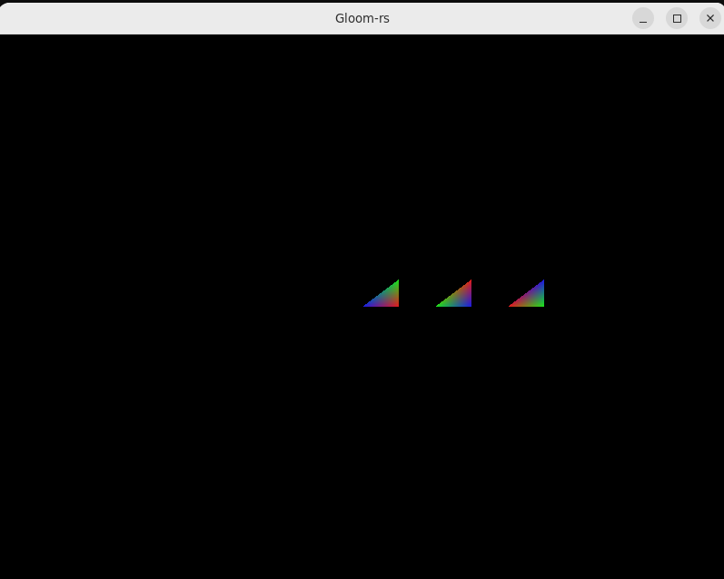
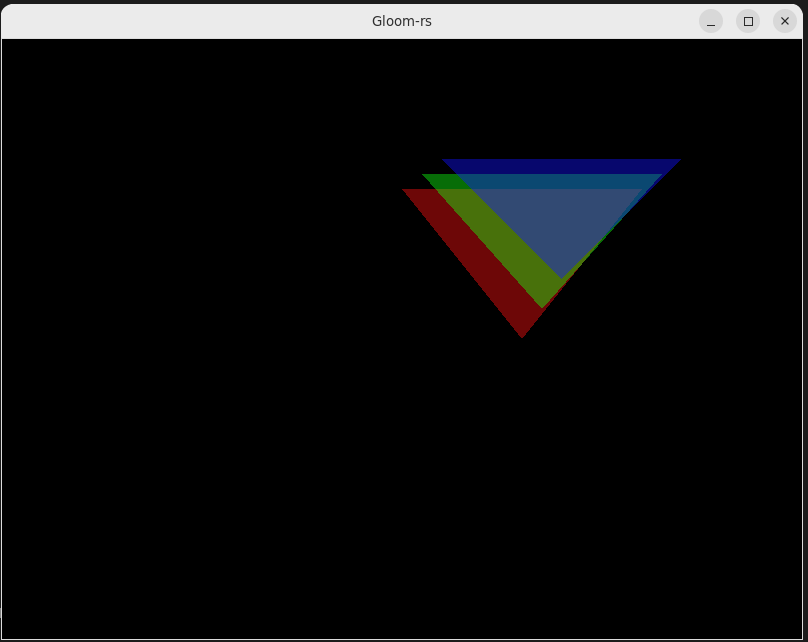
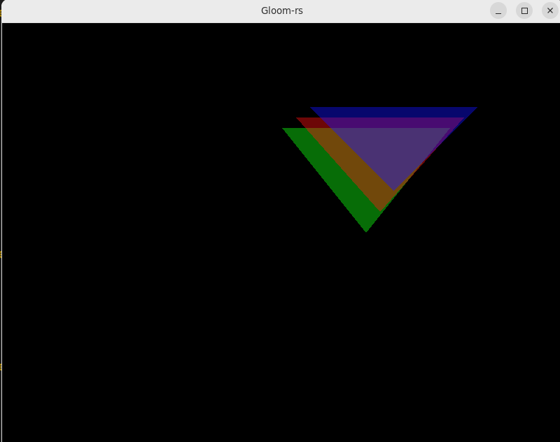

---
# This is a YAML preamble, defining pandoc meta-variables.
# Reference: https://pandoc.org/MANUAL.html#variables
# Change them as you see fit.
title: TDT4195 Exercise 1 
author:
- Ivan Zubčić 
date: \today # This is a latex command, ignored for HTML output
lang: en-US
papersize: a4
geometry: margin=4cm
toc: false
toc-title: "Table of Contents"
toc-depth: 2
numbersections: true
header-includes:
# The `atkinson` font, requires 'texlive-fontsextra' on arch or the 'atkinson' CTAN package
# Uncomment this line to enable:
#- '`\usepackage[sfdefault]{atkinson}`{=latex}'
colorlinks: true
links-as-notes: true
# The document is following this break is written using "Markdown" syntax
---

<!--
This is a HTML-style comment, not visible in the final PDF.
-->

`\clearpage`{=latex}

# Tasks	 

git repo: https://github.com/Zulejman/OpenGL---as1.git

## Task 1: Per-Vertex Colors

### a)
```rust
unsafe fn create_vao(vertices: &Vec<f32>, indices: &Vec<u32>, rgba: &Vec<f32>) -> u32 {

    let mut vao: u32 = 0;
    let mut vbo: u32 = 0;
    let mut indices_val: u32 = 0;
    let mut rgba_val: u32 = 0;

    gl::GenVertexArrays(1, &mut vao);
    gl::BindVertexArray(vao);
    gl::GenBuffers(1, &mut vbo);
    gl::BindBuffer(gl::ARRAY_BUFFER, vbo);

    gl::BufferData(gl::ARRAY_BUFFER, byte_size_of_array(vertices),  pointer_to_array(vertices), gl::STATIC_DRAW);

    gl::VertexAttribPointer(
        0,
        3,
        gl::FLOAT,
        gl::FALSE,
        3*size_of::<u32>(),
        ptr::null()
    );

    gl::EnableVertexAttribArray(0);

    // THIS PART FOR RGB

    gl::GenBuffers(1, &mut rgba_val);
    gl::BindBuffer(gl::ARRAY_BUFFER, rgba_val);
    gl::BufferData(gl::ARRAY_BUFFER, byte_size_of_array(rgba), pointer_to_array(rgba), gl::STATIC_DRAW);
    gl::VertexAttribPointer(
        1,
        4,
        gl::FLOAT,
        gl::FALSE,
        4 * size_of::<f32>(),
        ptr::null()
        );

    gl::EnableVertexAttribArray(1);

    gl::GenBuffers(1, &mut indices_val);
    gl::BindBuffer(gl::ELEMENT_ARRAY_BUFFER, indices_val);
    gl::BufferData(gl::ELEMENT_ARRAY_BUFFER, byte_size_of_array(indices),  pointer_to_array(indices), gl::STATIC_DRAW);

    gl::BindVertexArray(0);
    vao
} 
```

### Modified shaders:

Simple.frag:
```rust
#version 410 core
in vec4 fragColor;
out vec4 color;

void main()
{

        color = fragColor;
}
```

Simple.vert:
```rust
#version 410 core

layout(location = 0) in vec3 position;
layout(location = 1) in vec4 color;

out vec4 fragColor;

void main()
{
    gl_Position = vec4(position, 1.0f);
    fragColor = color;
```

### b) 

The colors in between vertex are meshing and transitioning to a new color.

## Task 2: Alpha Blending and Depth

### a)


### b)
Swapped colors now changed the rendered colors where the triangles overlap. They mix together and produce something new.
But we can still see through the triagnles:


Swapped depth changed the order of the triangles, and now the deepest triangle cannot be fully seen:


## Task 3: The Affine Transformation Matrix 

### a) 
This is just for multiplying with identity. Later I did change this to use uniform from main.rs to shader program.
```rust
#version 410 core


layout(location = 0) in vec3 position;
layout(location = 1) in vec4 color;

out vec4 fragColor;


void main()
{
    mat4 identity = mat4(1.0);
    gl_Position = identity * vec4(position, 1.0f);
    fragColor = color;
}
```

### b) 
When c and f are changed, we get translation. Scaling is done when chaging a and e elements. And
if b or d are changed, we get shear.

### c)
We don't have rotation since we don't do any changes on z axis(third column).

