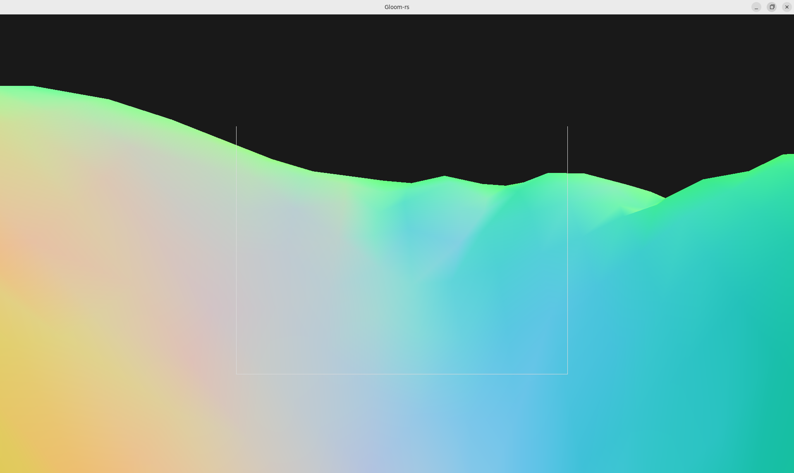
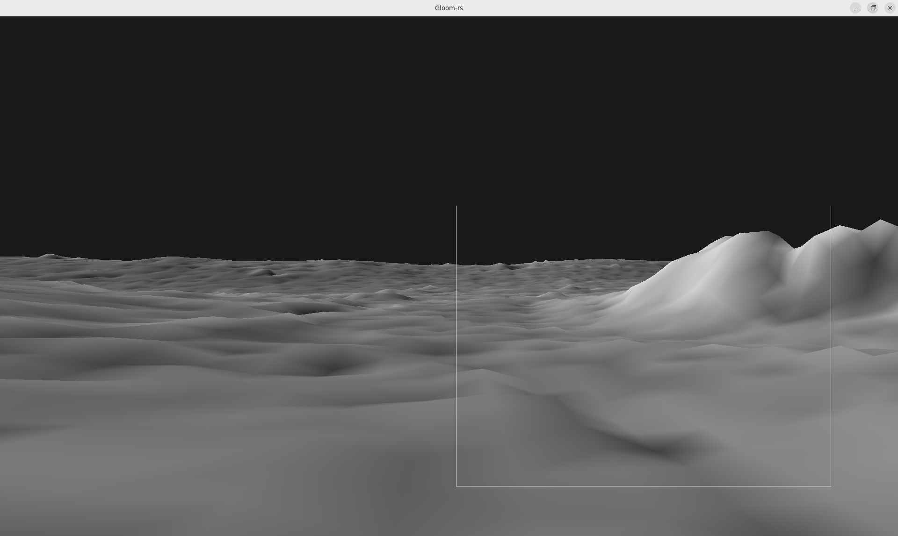
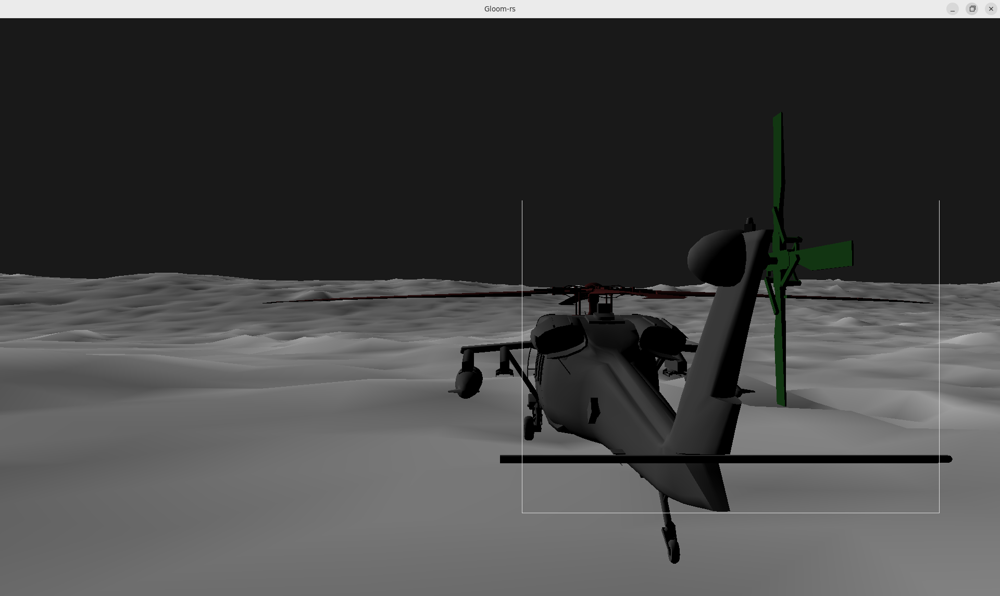
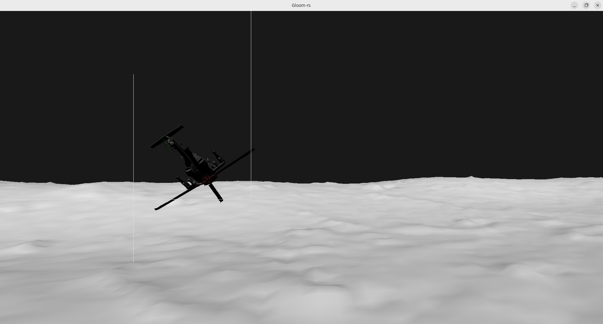
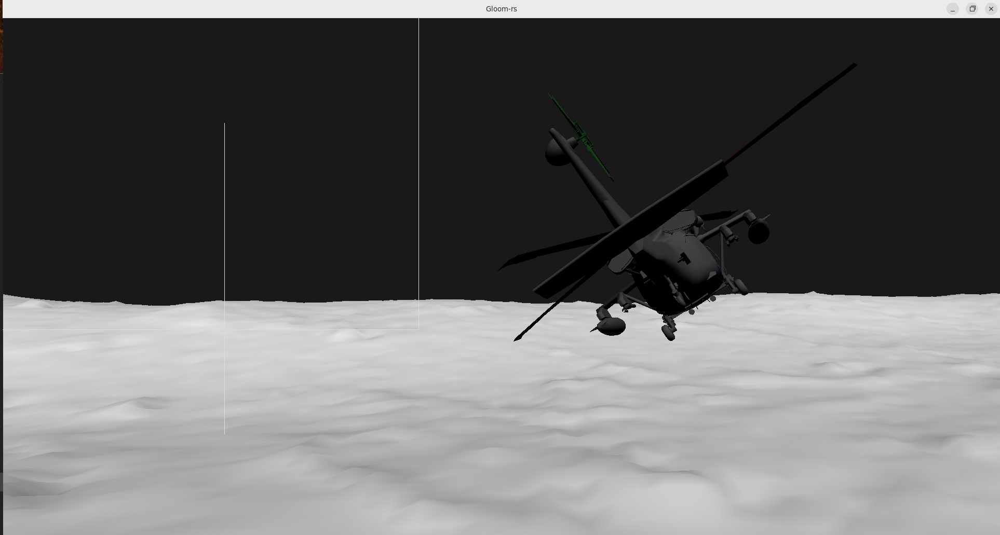

---
# This is a YAML preamble, defining pandoc meta-variables.
# Reference: https://pandoc.org/MANUAL.html#variables
# Change them as you see fit.
title: TDT4195 Exercise 3 
author:
- Ivan Zubčić 
date: \today # This is a latex command, ignored for HTML output
lang: en-US
papersize: a4
geometry: margin=4cm
toc: false
toc-title: "Table of Contents"
toc-depth: 2
numbersections: true
header-includes:
# The `atkinson` font, requires 'texlive-fontsextra' on arch or the 'atkinson' CTAN package
# Uncomment this line to enable:
#- '`\usepackage[sfdefault]{atkinson}`{=latex}'
colorlinks: true
links-as-notes: true
# The document is following this break is written using "Markdown" syntax
---

<!--
This is a HTML-style comment, not visible in the final PDF.
-->

`\clearpage`{=latex}

# Tasks	 
## Task 1: More polygons than you can shake a stick at
Here we load the mesh using mesh mod and we create VAO for the terrain.
```rust
let terrain_mesh = mesh::Terrain::load("./resources/lunarsurface.obj");
let terrain_vao = unsafe {create_vao(&terrain_mesh.vertices, 
&terrain_mesh.indices, &terrain_mesh.colors, &terrain_mesh.normals)};

#Loop part:
            unsafe {
                  gl::BindVertexArray(terrain_vao);
                  gl::DrawElements(
                      gl::TRIANGLES,
                      terrain_mesh.index_count,
                      gl::UNSIGNED_INT,
                      ptr::null(),
                  );
                  gl::BindVertexArray(0);
              }

```
Normals are added after configuring the create_vao 

## c) Vertex shader 


`\clearpage`{=latex}

## d) Vertex shader 


`\clearpage`{=latex}

## Task 2: Helicopter 


`\clearpage`{=latex}

## Task 5: Dark side 


