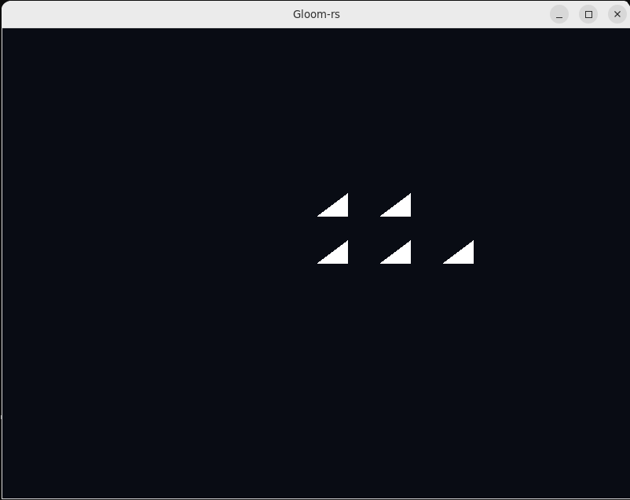

---
# This is a YAML preamble, defining pandoc meta-variables.
# Reference: https://pandoc.org/MANUAL.html#variables
# Change them as you see fit.
title: TDT4195 Exercise 1 
author:
- Ivan Zubčić 
date: \today # This is a latex command, ignored for HTML output
lang: en-US
papersize: a4
geometry: margin=4cm
toc: false
toc-title: "Table of Contents"
toc-depth: 2
numbersections: true
header-includes:
# The `atkinson` font, requires 'texlive-fontsextra' on arch or the 'atkinson' CTAN package
# Uncomment this line to enable:
#- '`\usepackage[sfdefault]{atkinson}`{=latex}'
colorlinks: true
links-as-notes: true
# The document is following this break is written using "Markdown" syntax
---

<!--
This is a HTML-style comment, not visible in the final PDF.
-->

`\clearpage`{=latex}

# Tasks	 

## Task 1: Drwaing your first triangle 

While creating the first triangle we need to use the function vao. This function creates Vertex Array Object (VAO) and binds it.
After creating VAO we create Vertex Buffer Object (VBO) which holds geometry data of the object. VBO like VAO is also binded. 
Basically VAO is object which takes data parameters (In this case float vector for vertex position and integer data for indices) for drawing the data on screen using OpenGL. 

This would be create_vao function we are using:

```rust
unsafe fn create_vao(vertices: &Vec<f32>, indices: &Vec<u32>) -> u32 {

    // This should:
    // * Generate a VAO and bind it
    // * Generate a VBO and bind it
    // * Fill it with data
    // * Configure a VAP for the data and enable it
    // * Generate a IBO and bind it
    // * Fill it with data
    // * Return the ID of the VAO

    let mut vao: u32 = 0;
    let mut vbo: u32 = 0;
    let mut indices_val: u32 = 0;

    gl::GenVertexArrays(1, &mut vao);
    gl::BindVertexArray(vao);
    gl::GenBuffers(1, &mut vbo);
    gl::BindBuffer(gl::ARRAY_BUFFER, vbo);

    gl::BufferData(gl::ARRAY_BUFFER, byte_size_of_array(vertices),  pointer_to_array(vertices), gl::STATIC_DRAW);

    gl::VertexAttribPointer(
        0,
        3,
        gl::FLOAT,
        gl::FALSE,
        3*size_of::<f32>(),
        ptr::null()
    );

    gl::EnableVertexAttribArray(0);

    gl::GenBuffers(1, &mut indices_val);
    gl::BindBuffer(gl::ELEMENT_ARRAY_BUFFER, indices_val);
    gl::BufferData(gl::ELEMENT_ARRAY_BUFFER, byte_size_of_array(indices),  pointer_to_array(indices), gl::STATIC_DRAW);

    gl::BindVertexArray(0);
    vao
}
```

Indices and creation of VAO with given vector values:

```rust
let my_vert: Vec<f32> = vec![
            0.1, 0.0, 0.0,
            0.1, 0.1, 0.0,
            0.0, 0.0, 0.0,

            0.3, 0.0, 0.0,
            0.3, 0.1, 0.0,
            0.2, 0.0, 0.0,

            0.5, 0.0, 0.0,
            0.5, 0.1, 0.0,
            0.4, 0.0, 0.0,

            0.1, 0.2, 0.0,
            0.1, 0.3, 0.0,
            0.0, 0.2, 0.0,

            0.3, 0.2, 0.0,
            0.3, 0.3, 0.0,
            0.2, 0.2, 0.0
        ];


        let my_indi: Vec<u32> = vec![
            0, 1, 2,
            3, 4, 5,
            6, 7, 8,
            9, 10, 11,
            12, 13, 14
        ];

        let my_vao = unsafe { create_vao(&my_vert, &my_indi)};
```


Before we draw the triangles we need to link shaders:

```rust
let simple_shader = unsafe {
                shader::ShaderBuilder::new()
                .attach_file("./shaders/simple.vert")
                .attach_file("./shaders/simple.frag")
                .link()
        };
```

`\clearpage`{=latex}

And after clearing the scene we now can draw our triangles:

```rust
unsafe {
                // Clear the color and depth buffers
                gl::ClearColor(0.035, 0.046, 0.078, 1.0); // night sky
                gl::Clear(gl::COLOR_BUFFER_BIT | gl::DEPTH_BUFFER_BIT);


                // == // Issue the necessary gl:: commands to draw your scene here
                //
                simple_shader.activate();

                gl::BindVertexArray(my_vao);
                gl::DrawElements(gl::TRIANGLES, my_indi.len() as i32, gl::UNSIGNED_INT, ptr::null());
                gl::BindVertexArray(0);
            }
```



`\clearpage`{=latex}

#Task 2: Geometry and Theory


##a)
This phenimenon is called "Clipping". It occurs when some part of the object is outside of view area. 
Clipping is used for improvement in computational performance in a way that we don't need to do calculations for 
parts that are not visible to us.i) What is the name of this phenomenon?
ii) When does it occur?
iii) What is its purpose?

##b)
i) What happens?
This is the data for the triangles we are trying to draw:
```rust
 let my_vert: Vec<f32> = vec![
            0.1, 0.0, 0.0,
            0.1, 0.1, 0.0,
            0.0, 0.0, 0.0,

            0.3, 0.0, 0.0,
            0.3, 0.1, 0.0,
            0.2, 0.0, 0.0,

            0.5, 0.0, 0.0,
            0.5, 0.1, 0.0,
            0.4, 0.0, 0.0,
        ];

        let my_indi: Vec<u32> = vec![
            0, 2, 1,
            3, 4, 5,
            6, 7, 8
        ];
```
In this case we modified index buffer in a way where the first triangle has 
replaced indices on my_indi[1] and my_indi[2]. The outcome is that the firs
triangle is not drawn.


ii) Why?
This happens bevause of the "Winding Order". Using winding order OpenGL determines triangles facing direction.
If they are defined in clockwise order, the triangles are interpreted as front facing. If we change these values,
triangles can be interpreted as back facing. 

iii)
The back facing ones are not rendered due to cull parameter.  
```rust
            gl::Enable(gl::CULL_FACE);
``` 

##c)
i) Why does the depth buffer need to be reset each frame? Describe what you
would observe in a scene with sphere moving leftward when not clearing the
depth buffer.
 
The depth buffer is respnsible for the information of depth of an object. Or z-axis in x,y,z coordinate sytem.
The buffer is cleared every time so that the old data does not interfere with current values shown on the scree.
If the data wasn't cleared, we would see artifacts.

ii) In which situation can the Fragment Shader be executed multiple times for the
same pixel? (Assume we do not use multisampling.)

In a situation where be have geometry with different depths. Where one fragment would be "hidden" behind the other 
one. We will calculate the value for both fragments, but take value of only the one infront.

iii) What are the two most commonly used types of Shaders?
What are the responsibilities of each of them?
 
Most conomly used ones are fragment and vertex shader.
Vertex shader is resonsible for positioning varuables. Transformiing vertex positions from object space to sceen space.

Fragment shader are more responsible for effect variabes. Such as: color, texture , lightning.

iiii) Why is it common to use an index buffer to specify which vertices should be
connected into triangles, as opposed to relying on the order in which the vertices
are specified in the vertex buffer(s)?

For computing cost. In this way we can reuse vertices and get better performance. 

v) While the last input of gl::VertexAttribPointer() is a pointer, we usually pass
in a null pointer. Describe a situation in which you would pass a non-zero value
into this function.

This pointer represents the offset value for the vertex data. So If we have a data in a buffer
that isn't only vertex data, using this offset we can specify where does vertex data begin.

`\clearpage`{=latex}

Enable and use the `pandoc-crossref` filter to reference figures, tables and equations.
